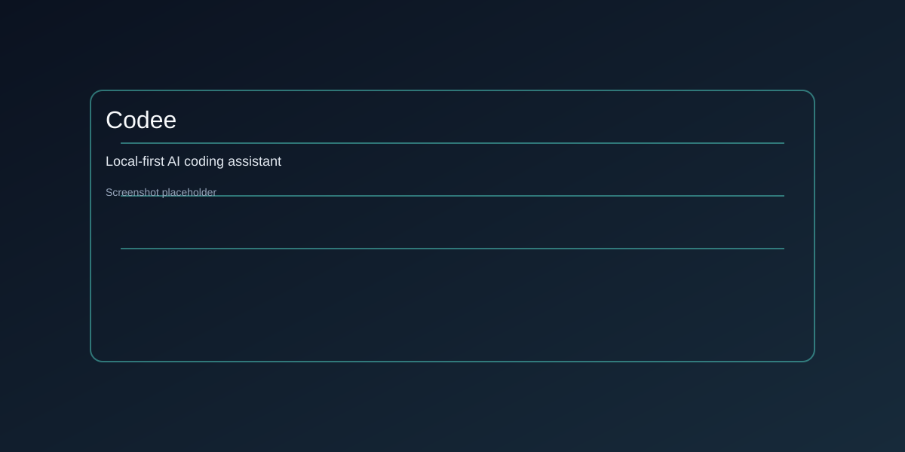
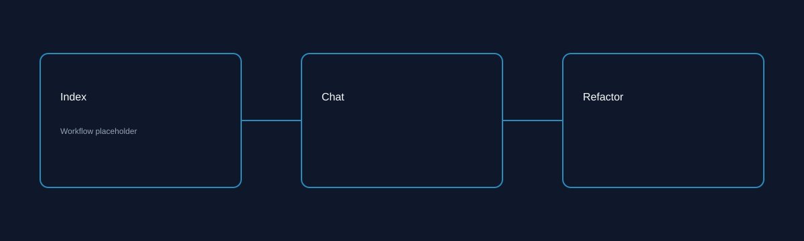
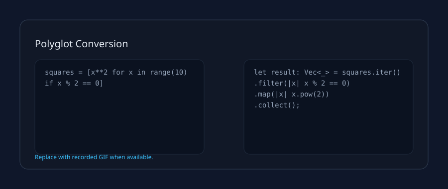

# Codee

**Limited Public Beta** - v0.9.0-beta.1

Codee is a local-first AI coding assistant with offline-first workflows, fast indexing, and VS Code-native UX.

## Install (Beta)
- Desktop: download installers from GitHub Releases (`codee-desktop-mac.dmg`, `codee-desktop-win.exe`, `codee-desktop-linux.AppImage`).
- VS Code: install `codee-vscode.vsix` via the Extensions view (Install from VSIX).
- First run: open Codee and complete the onboarding wizard.

## Polyglot Coding

**Learn one language, know them all.** Codee converts idiomatic Python, TypeScript, Rust, Go, Java, C++, Kotlin, Scala, C#, Swift, and Dart without line-by-line translation.
Codee now speaks 11 languages: Python, TypeScript, Rust, Go, Java, C++, Kotlin, Scala, C#, Swift, and Dart.

Supported patterns (beta):

| Pattern | Python | TypeScript | Rust | Go | Java | C++ | Kotlin | Scala | C# | Swift | Dart |
| --- | --- | --- | --- | --- | --- | --- | --- | --- | --- | --- | --- |
| List/sequence pipelines | Yes | Yes | Yes | Yes | Yes | Yes | Yes | Yes | Yes | Yes | Yes |
| Map/dictionary literals | Yes | Yes | Yes | Yes | Yes | Yes | Yes | Yes | Yes | Yes | Yes |
| Dataclasses / records / structs | Yes | Yes | Yes | Yes | Yes | Yes | Yes | Yes | Yes | Yes | Yes |
| Async/await flows | Yes | Yes | Yes | Yes | Yes | Yes | Yes | Yes | Yes | Yes | Yes |
| Error handling (try/catch/Result) | Yes | Yes | Yes | Yes | Yes | Yes | Yes | Yes | Yes | Yes | Yes |
| Decorators / attributes | Yes | Yes | Yes | Yes | Yes | Yes | Yes | Yes | Yes | Yes | Yes |

## Documentation
- User Guide: docs/user-guide.md
- FAQ: docs/faq.md
- Troubleshooting: docs/troubleshooting.md
- Architecture: docs/README.md

## Feedback & Support
- In-app: use **Codee: Send Feedback** or the Help panel.
- GitHub Discussions: https://github.com/your-org/codee/discussions
- Email: support@codee.ai (beta)
- Status page (placeholder): docs/status.md

## Repo Structure
- apps: runnable applications (desktop shell, extension host, future services)
- packages: shared libraries and core product capabilities
- tools: shared build and repo tooling

## Quick Start (Contributors)
Requires Node 20 LTS.

1. Install dependencies: npm install
2. Initialize git hooks: npm run prepare
3. Build all: npm run build
4. Run desktop app dev loop: npm run dev

## Architecture Notes
- The desktop app embeds Electron with a VS Code extension host.
- AI orchestration lives in core-engine and is designed for local LLMs first.
- Data storage uses SQLite with migrations for deterministic upgrades.
