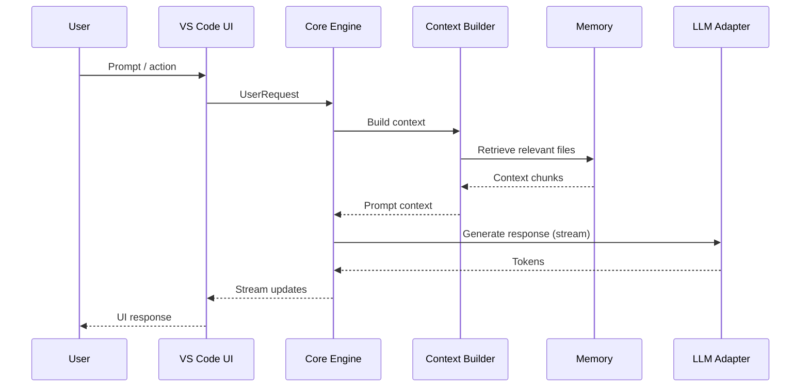
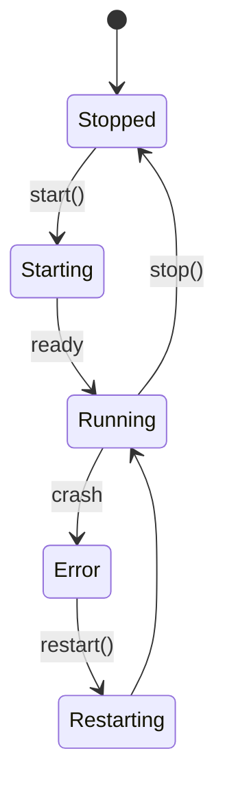

# Data Flow

This document describes how a user request flows through Codee.

## Request Flow

```mermaid
sequenceDiagram
  participant U as User
  participant V as VS Code UI
  participant E as Core Engine
  participant C as Context Builder
  participant M as Memory
  participant L as LLM Adapter
  U->>V: Prompt / action
  V->>E: UserRequest
  E->>C: Build context
  C->>M: Retrieve relevant files
  M-->>C: Context chunks
  C-->>E: Prompt context
  E->>L: Generate response (stream)
  L-->>E: Tokens
  E-->>V: Stream updates
  V-->>U: UI response
```

## Language Server Lifecycle

```mermaid
stateDiagram-v2
  [*] --> Stopped
  Stopped --> Starting: start()
  Starting --> Running: ready
  Running --> Error: crash
  Error --> Restarting: restart()
  Restarting --> Running
  Running --> Stopped: stop()
```
