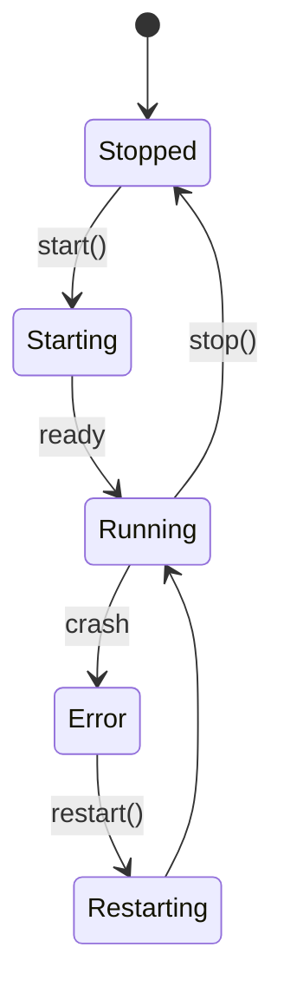

# Language Server Lifecycle

```mermaid
stateDiagram-v2
  [*] --> Stopped
  Stopped --> Starting: start()
  Starting --> Running: ready
  Running --> Error: crash
  Error --> Restarting: restart()
  Restarting --> Running
  Running --> Stopped: stop()
```
