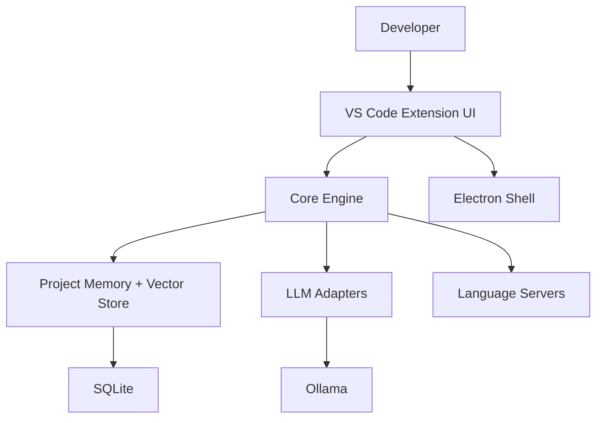
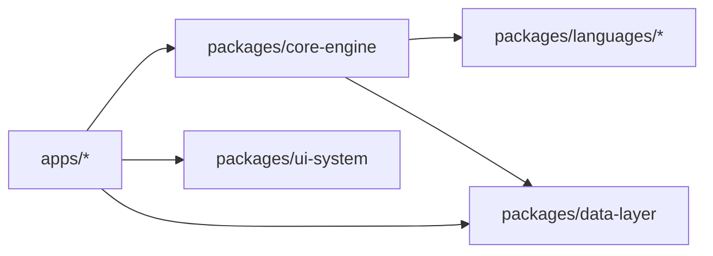

# Architecture Overview

Codee is a local-first AI coding assistant built as a TypeScript monorepo. The desktop shell is Electron hosting a VS Code extension runtime, while core AI logic runs in shared packages.

## Tech Stack
- TypeScript 5.3+ (strict)
- Electron (desktop shell)
- VS Code Extension API (editor integration)
- SQLite (local-first persistence)
- Local LLM inference (Ollama) with cloud fallback support

## System Architecture

## Package Dependencies

